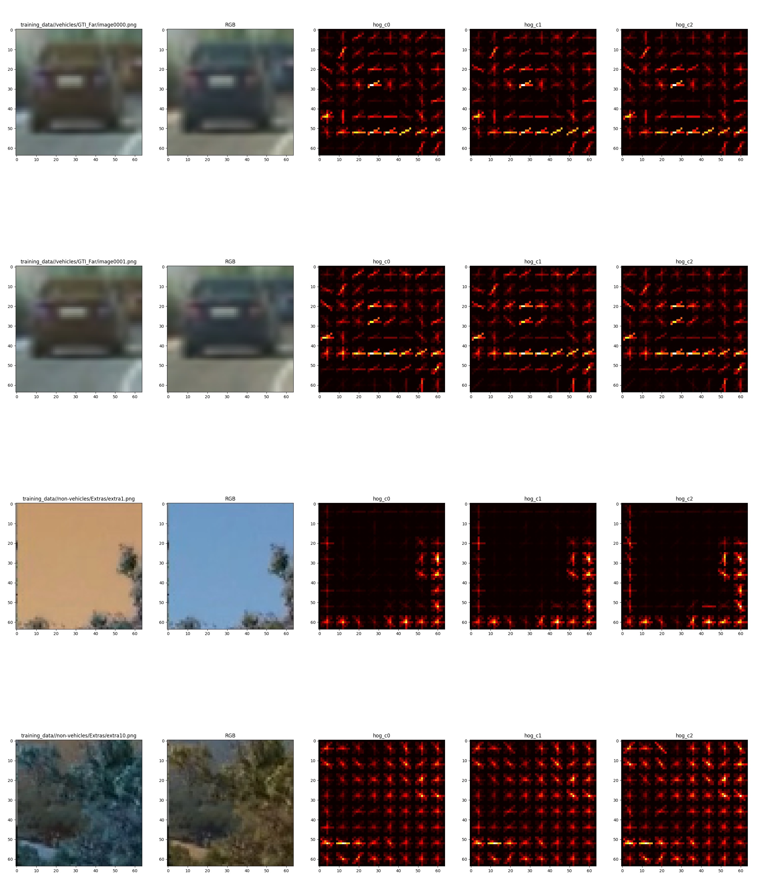
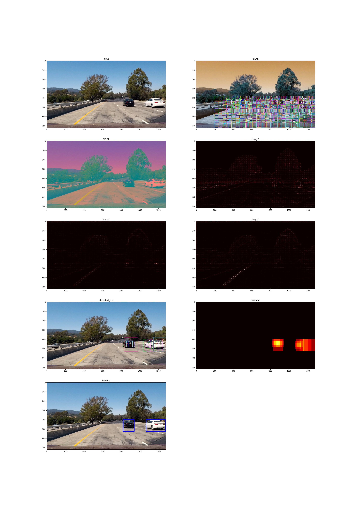

# Vehicle Detection
[](http://www.udacity.com/drive)

## Goals
- Write a software pipeline to detect vehicles in the project_video.mp4
- detailed writeup of the project


Steps Involved:

* Train a Linear SVM classifier using labeled training set
	-  image features
		- Histogram of Oriented Gradients (HOG)
		- color transform
		- binned color
		- histogram
	-  normalize the selected features
	-  split training and test data set from the input data
* Using Sliding-window technique and classifier, search for vehicles in test images
	- Estimate a bounding box for vehicles detected.
* Run pipeline on video stream
	- Reject outliers by rejecting non-recurring detections frame by frame

[Rubric Points](https://review.udacity.com/#!/rubrics/513/view)


## Code
The code vehicle detection code in `vehicle_detection.py` is organized into 2 classes:

|class|notes|
|---|---|
|VehicleDetection|Video Processing, Frame processing, Sliding window and hog subsampling|
|Model|Feature extraction and model training. Saving and loading model.|

Model parameters are externalized into a model config file. An example:

```
info: |
   Basic Parameters for testing
model:
  classifier: linear
  test_train_split: 0.2
  color_space: YCrCb
  hog: 
    enabled: true
    orient: 9
    pix_per_cell: 8
    cell_per_block: 2
    channel: ALL
  spatialbin:
    enabled: true
    size: 32
  colorhist:
    enabled: true
    bins: 32
```

Similarly the vehicle detection search windows are parameterized.

```
info: |
   Finetuning
vehicle_detection:
  search_mode: windows
  search_scales:
   - xrange: [325, 1275]
     yrange: [380, 540]
     winsize: [64, 64]
     overlap: [0.7, 0.7]
   - xrange: [325, 1275]
     yrange: [390, 540]
     winsize: [48, 48]
     overlap: [0.6, 0.6]
   - xrange: [200, 0]
     yrange: [400, 0]
     winsize: [128, 128]
     overlap: [0.7, 0.7]
   - xrange: [200, 0]
     yrange: [380, 0]
     winsize: [150, 150]
     overlap: [0.7, 0.7]
  box_thickness: 2
  box_color: [0, 0, 255]
  threshold: 1
```


## Training the Classifier
### Training Data

Curated data from a combination of the [GTI vehicle image database](http://www.gti.ssr.upm.es/data/Vehicle_database.html), the [KITTI vision benchmark suite](http://www.cvlibs.net/datasets/kitti/), and examples extracted from the project video itself.

- [vehicle](https://s3.amazonaws.com/udacity-sdc/Vehicle_Tracking/vehicles.zip)
- [non-vehicle](https://s3.amazonaws.com/udacity-sdc/Vehicle_Tracking/non-vehicles.zip)

### Training
For training, all the images were read in `BGR` colorspace and based on model params converted to YCrCb or RGB colorspace. Somehow reading in `RGB` colorspace lead to a poor performance (could be a coding bug as well).

### Feature Extraction
Based on the model params the following features are extrated and concatenated into a single linear array:

1. HOG
2. Spatial Bin
3. Color Histogram

#### Histogram of Oriented Gradients (HOG)
`Model.get_hog_features()` implements the HOG feature extraction. Based on model params, all or a specific hog channel is used. For training and window search cases, the extacted params are flattened using `ravel()`. 

#### Choosing HOG params
Ran the training on different hog parameters and chose the mode with high accuracy and low training time.

|model|color|spatial bin|hist bin|hog channel|orient|pix/cell|cell/block|time|accuracy|
|---|---|---|---|---|---|---|---|---|---|
|ycrcb2088a\_32_32|ycrcb|32|32|all|20|8|8|21.34|0.9949|
|**ycrcb872a\_32_32**|ycrcb|32|32|all|8|7|2|9.01|0.993|
|ycrcb982a\_32_32|ycrcb|32|32|all|9|8|2|16.21|0.9924|
|ycrcb882a\_32_32|ycrcb|32|32|all|8|8|2|4.88|0.9904|
|ycrcb984a\_32_32|ycrcb|32|32|all|9|8|4|15.53|0.9907|
|ycrcb988a\_32_32|ycrcb|32|32|all|9|8|8|11.08|0.9938|
|rgb872a\_32_32|ycrcb|32|32|all|8|7|2|34.3|0.9842|
|rgb882a\_32_32|ycrcb|32|32|all|8|8|2|22.66|0.984|


Example HOG outputs for training images.

**Model: rgb882a\_32_32**


**Model: ycrcb872a\_32_32**


#### Spatial Bin and Color Histogram
`Model.bin_spatial()` implements the Spatial color binning feature extraction.
`Model.color_hist()` implements the Color Histogram feature extraction.
All the feature extractions are parameterized via model params.

## Image Processing

### Sliding Window Search implementation
`VehicleDetection.search_windows()` implements searching the input image using window search. The search-windows are calculated for the first image and reused for the rest of the images. `VehicleDetection.generate_windows()` is called to calculate the search windows based on the search config `vehicle_detection.search_scales`. The search windows closer to the road horizon are smaller and the xrange is limited to the center of the image. As we approach the bottom of the image, the xrange increases to include more of the left and right of the frame. Also the window size also increases. This is to model the natural behaviour of objects appearing smaller at distances.

`VehicleDetection.find_cars()` implements searching the input using HOG-subsampling window search.

### Heatmap
Multiple overlapping windows are detected around a car. Some false positives windows are also detected around the edges of the road along the divider and trees. Combining overlapping windows into a heatmap and thresholding the image filters out outliers in the image.

### Labelling
Heatmap and thresholding results in blobs of detected areas. To find the bounding boxes for those regions, `scipy.ndimage.measurements.label()` is used.
The detection of lables is done in `VehicleDetection.process_frame()` and the boxes are drawn on the image using `VehicleDetection.draw_labeled_boxes()`

### Sample Image Processing Pipeling Output

**Model: ycrcb872a_32\_32, Window-params: detection\_wins\_1.yml**


**Model: rgb882a_32\_32, Window-params: detection\_wins\_1.yml**


**Model: ycrcb2088a_32\_32, Window-params: detection\_hog\_1.yml**


## Video Processing
`VehicleDetection.process_clip()` takes the video path as input and uses `VehicleDetection.process_frame()` on each of the video frame extracted using `VideoFileClip().fl_image()`.

All the search windows are parameterized in the params file.

|params|notes|processed test_video|processed output_video|
|---|---|---|---|
|detection_hog1|Decent Accuracy. test\_video 10s, project_video in 6m30s| [Test Video Output](./output_images/output_test_hog1_video.mp4)|[Project Video Output](./output_images/output_project_hog1_video.mp4)|
|detection_hog2|Poor Accuracy. test\_video in 40s|-|-|
|detection_win1|Very Good Accuracy. test\_video in 2m, project_video in 60m|[Test Video Output](./output_images/output_test_video_win1.mp4)|**[Project Video Output](./output_images/output_project_win1_video.mp4)**|
|detection_win2|Good Accuracy. test\_video in 1m42s, project_video in 24m|[Test Video Output](./output_images/output_test_video_win2.mp4)|[Project Video Output](./output_images/output_project_win2_video.mp4)|

## Discussion

- Colorspace (RGB, BGR) seemed to impact the performance on the video frames.
- The video frames are RGB but training using RGB was somehow resulting in poor detection. (need to figure that part out)
- Using previous detected bounding boxes as inputs to filter out outliers could help in cases where the surface or shadows change. And example is the bridge on the curve in the video.
- cars on the horizon are not being detected. Possible improvement is to add horizon search windows that are small.


